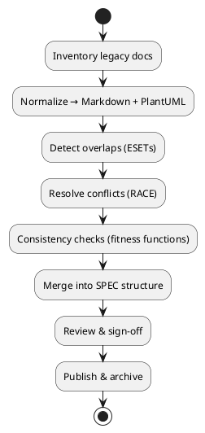

# SPEC-000 – Spec Consolidation Playbook

## Background

After ~8 months of development, multiple specs exist across system and component levels, in varied formats and depths. This playbook defines a repeatable, auditable method to consolidate them into a single, authoritative technical specification that mirrors the current implementation and decisions.

## Requirements

**Must**
- Single source of truth (SSoT) for architecture and interfaces.
- Traceability from each legacy doc/section to the unified spec (disposition log).
- Clear conflict-resolution rubric with rationale recorded (ADRs/disposition notes).
- Architectural consistency across layers (domain, application, infrastructure) and cross-cutting concerns (security, reliability, observability).
- Versioned with code; reviewable via PRs; CI linting for docs and diagrams.

**Should**
- Diagrams and models as code (PlantUML/Structurizr DSL) generated in CI.
- Canonical glossary and domain model.
- Section numbering and stable anchors for cross-references.
- Link to live artifacts (OpenAPI schemas, DB migrations, IaC modules).

**Could**
- Automated overlap detection via semantic similarity.
- Docs portal (docs-as-code) with search and backlink graph.
- Fitness functions checking architectural rules in CI.

**Won’t (now)**
- Preserve full history of all legacy docs verbatim. Keep only key decisions and rationale.

## Method

### Phase 0 — Setup (1–2 hours effort)
- Choose canonical format: **Markdown + PlantUML** (text-first, diffable).
- Create working tree:
  ```text
  /docs
    /_inbox         # raw legacy imports
    /_archive       # frozen originals, read-only
    /_unified       # work-in-progress consolidated spec
    /adr            # Architecture Decision Records
    /assets         # images/diagrams
  ```
- Establish a **doc ID scheme**: `DOC-###`, `ADR-YYYYMM-##`, and `SPEC-###-<slug>`.
- Define CI tasks: link-check, markdownlint, plantuml render, glossary check, table-of-contents, spellcheck.

### Phase 1 — Inventory & Ingestion
- Build an inventory for every existing spec/slide/diagram/ticket.
- **Inventory fields** (CSV or Sheet):
  - `DocID`, `Title`, `Owner`, `SourcePath/URL`, `LastModified`, `Scope` (System|Component|Process|Policy), `DomainArea`, `Status` (Draft|Final), `Confidence (0–1)`, `References`, `Notes`.
- Sample shell to collect files:
  ```bash
  # macOS/Linux
  fd -e md -e docx -e pdf -e drawio -e pptx . ./ | awk '{print $0",",strftime("%Y-%m-%d", systime())}' > docs/_inbox/inventory.csv
  ```
- Keep originals **read-only** under `/docs/_archive`.

### Phase 2 — Normalize & Parse
- Convert all sources to Markdown where possible (use Pandoc for docx/pptx/pdf text) and PlantUML for diagrams.
- Enforce heading taxonomy: `H1=Spec Title`, `H2=Sections`, `H3=Subsections`.
- Apply a **front-matter block** to each file:
  ```yaml
  ---
  docid: DOC-021
  source: gdoc:.../edit
  last_reviewed: 2025-08-24
  scope: Component
  owners: [team-abc]
  ---
  ```

### Phase 3 — Overlap & Duplication Detection
- **Heuristics**
  - Title/heading similarity (cosine on TF–IDF) ≥ 0.7 → candidate duplicate.
  - Shared key phrases (e.g., service names, API paths, table names).
  - Same diagram focus (component name / context box labels).
- **Manual checklist**
  - Do both describe the same *capability* (e.g., "User session management")?
  - Is one a superset/subset? Does one reference newer dependencies?
  - Which aligns with code/tests in `main`?
- Create an **Equivalence Set** (ESET) per topic:
  - `ESET-12: Authentication` → {DOC-004, DOC-019, DOC-044}

### Phase 4 — Conflict Resolution (RACE rubric)
Use **RACE** to decide which version wins:
1. **Recency** — newer *effective* dates & references to current versions.
2. **Alignment with code** — conforms to code in `main`, current DB migrations, OpenAPI/Protobuf schemas.
3. **Consensus** — endorsed by owners; linked ADR present; reviewed in PRs.
4. **Evidence** — benchmarks, incident postmortems, SLOs, security findings.

**Procedure**
- For each ESET, create a **Disposition Log** entry:
  ```yaml
  eset: ESET-12
  topic: Authentication
  kept: DOC-044 # reason: aligns with OpenAPI v2.3, merged 2025-07-02
  merged_from: [DOC-004]
  superseded: [DOC-019]
  rationale: >
    DOC-044 matches current code, includes token rotation; DOC-019 obsolete.
  followups:
    - update sequence diagram for refresh-token edge case
    - add rate-limit policy to gateway section
  owner: platform-identity
  decided_on: 2025-08-24
  ```
- Log any *new* decisions as **ADR**s; reference them from the disposition.

### Phase 5 — Consistency & Conformance
- Define **Architecture Principles** (e.g., API-first, Idempotency, Backward compatibility, Zero-trust, Observability-by-default).
- Run **Consistency Checks**:
  - **C4** alignment: Context → Container → Component → Code mappings.
  - **Interface contracts**: OpenAPI/AsyncAPI/Protobuf present and versioned.
  - **Data model**: ERD ↔ migrations ↔ ORM models.
  - **NFRs**: Latency, throughput, error budgets, RTO/RPO.
  - **Security**: AuthZ model, secrets management, data classification.
  - **Operational**: SLOs, alerts, dashboards, runbooks.
- **Fitness Functions (examples)**
  - *Java/Kotlin*: ArchUnit rules (layers, package cycles).
  - *Python*: import-linter (enforce boundaries), bandit (security).
  - *JS/TS*: ESLint import rules, dependency-cruiser.
  - *Infra*: terraform `tflint`, OPA/Conftest policies.

### Phase 6 — Merge into the Unified SPEC
- Use the following canonical structure for the final doc:
  ```markdown
  # SPEC-<n>-<title>
  
  ## Background
  ## Requirements (MoSCoW)
  ## Method (Architecture, Schemas, Algorithms, Diagrams)
  ## Implementation (Steps, owners, commands)
  ## Milestones
  ## Gathering Results (KPIs, acceptance)
  ## Need Professional Help in Developing Your Architecture?
  ```
- **Cross-references**: include a *"Legacy Mapping"* appendix listing every DOC-### → section anchor in the SPEC.
- **Diagrams as code** — re-create diagrams in PlantUML for consistency.

**Example process diagram (PlantUML)**


### Phase 7 — Review & Sign-off
- **Roles**: Author, Architecture Reviewer, Security, SRE, QA, Product.
- **Checklist**
  - All ESETs have disposition entries.
  - All interfaces have versioned contracts and examples.
  - Diagrams render in CI; links pass link-checker.
  - Glossary terms defined and used consistently.
- Approval via PR with required reviewers.

### Phase 8 — Publish & Govern
- Publish to a docs portal (e.g., static site generator) from `/docs/_unified`.
- Tag repo (e.g., `spec-v1.0.0`) and freeze disposition log snapshot.
- Ongoing governance:
  - New changes require ADR or SPEC PR linking to issues.
  - Quarterly doc hygiene: inventory drift, broken links, diagram refresh.

## Implementation

### Folder & Naming Conventions
- `SPEC-###-<kebab-title>.md` (stable numeric ID).
- `adr/ADR-YYYYMM-##.md` for decisions.
- `assets/diagrams/<area>/<name>.puml` for PlantUML.

### Starter Files
- **SPEC template**
  ```markdown
  # SPEC-001-<project-name>
  
  ## Background
  ...
  
  ## Requirements
  - **Must**: ...
  - **Should**: ...
  - **Could**: ...
  - **Won’t**: ...
  
  ## Method
  ### Architecture Overview (C4-Context)
  ```
  
  ```plantuml
  @startuml
  !include <C4/C4_Context>
  Person(user, "User")
  System(sys, "System", "")
  Rel(user, sys, "Uses")
  @enduml
  ```
  
  ### Components, Data Model, Algorithms
  
  ## Implementation
  Steps, owners, commands.
  
  ## Milestones
  
  ## Gathering Results
  KPIs, acceptance tests.
  ```

- **ADR template**
  ```markdown
  # ADR-YYYYMM-##: <Title>
  
  ## Status
  Proposed | Accepted | Superseded by ADR-XXXX
  
  ## Context
  
  ## Decision
  
  ## Consequences
  
  ## References
  ```

- **Disposition Log (CSV)**
  ```csv
  eset,topic,kept,merged_from,superseded,rationale,owner,decided_on
  ESET-12,Authentication,DOC-044,"[DOC-004]","[DOC-019]","Aligns with code",platform-identity,2025-08-24
  ```

### CI/Lint Examples
```yaml
# .github/workflows/docs.yml
name: Docs
on: [push, pull_request]
jobs:
  lint:
    runs-on: ubuntu-latest
    steps:
      - uses: actions/checkout@v4
      - uses: actions/setup-java@v4
        with: { java-version: '17', distribution: 'temurin' }
      - run: pipx install markdown-link-check mdformat
      - run: mdformat --check docs/_unified
      - run: npx -y markdown-link-check -q -p docs/_unified/**/*.md
      - name: Render PlantUML
        run: |
          curl -L -o plantuml.jar http://sourceforge.net/projects/plantuml/files/plantuml.jar/download
          find docs -name '*.puml' -print0 | xargs -0 -I{} java -jar plantuml.jar {}
```

### Glossary Template
```markdown
# Glossary
- **Tenant**: Logical customer boundary used for data isolation.
- **IdP**: Identity Provider; issues tokens.
- **SLO**: Service Level Objective.
```

### Traceability Matrix Template
```markdown
| Legacy Doc | Section | SPEC Section | Notes |
|---|---|---|---|
| DOC-019 | 3.2 Token Flow | SPEC-001 §Method→Auth→Token Flow | superseded by DOC-044 |
```

## Milestones
1. Inventory & ingestion complete; all files normalized to Markdown; inventory sheet published.
2. ESETs identified; disposition log started; top 5 areas resolved.
3. Consistency checks passing (C4 layers, interfaces, data model).
4. SPEC draft complete with cross-references and diagrams rendering.
5. Review & sign-off done; repo tagged; legacy docs archived.

## Gathering Results
- **Acceptance criteria**
  - 100% of legacy docs mapped to SPEC or archive with rationale.
  - 0 critical link-check errors; 0 rendering failures.
  - All public interfaces represented with versioned contracts.
  - Reviewers sign off; no Sev-1 inconsistency found in first month.
- **KPIs**
  - % ESETs resolved; Mean time to resolve conflicts.
  - # ADRs added; # of glossary terms.
  - Search success (top-5 queries find correct section in <3 clicks).

## Need Professional Help in Developing Your Architecture?
Please contact me at [sammuti.com](https://sammuti.com) :)

